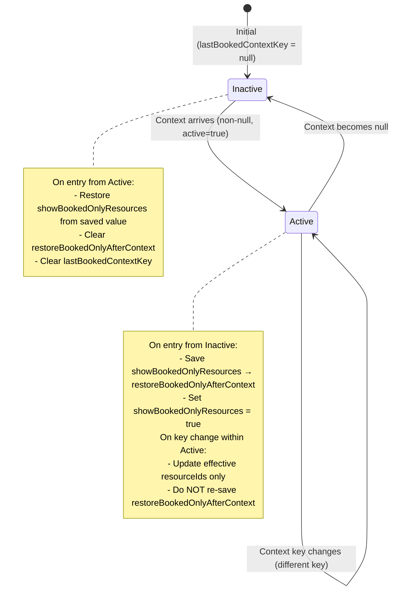

# Design Document: Booked Resource Filter

## Overview

The Booked Resource Filter feature provides automatic resource visibility management in the scheduler based on booking context. When a user focuses on a specific order or views an auto-proposal, the scheduler narrows the visible resources to only those with relevant bookings — reducing visual clutter and helping the planner focus on the work at hand.

The feature spans two components:
1. **ServicePlannerComponent** — derives the filter context from application state (focused order or auto-proposal) and provides helper methods for collecting booked resource IDs.
2. **CustomSchedulerComponent** — receives the filter context as an input, manages internal filter state, and applies the resource visibility filter.

### Design Decisions

- **Computed property approach**: The filter context is derived as a getter (`schedulerBookedResourceFilterContext`) rather than imperative state updates, ensuring the context always reflects the current application state without manual synchronization.
- **State save/restore pattern**: When an external context activates the booked-only filter, the scheduler saves the user's manual toggle state and restores it when the context is removed. This prevents user preferences from being lost during automated filtering.
- **Union semantics for external context**: When an external context is provided, the effective booked resource set is the context's `resourceIds`. When no context is present, the internally derived set (from events + capacity blocks) is used. Requirement 7.4 extends this to union both sets when a context is active.

## Architecture

```mermaid
graph TD
    subgraph ServicePlannerComponent
        A[Application State] --> B[schedulerBookedResourceFilterContext getter]
        A --> C[getBookedResourceIdsForOrder]
        A --> D[getBookedResourceIdsForVisibleSchedule]
        A --> E[isEventForOrder / isEntryForOrder]
    end

    subgraph CustomSchedulerComponent
        B -->|@Input binding| F[bookedResourceFilterContext]
        F --> G[syncBookedFilterWithContext]
        G --> H[showBookedOnlyResources toggle]
        G --> I[Save/Restore state]
        J[events/capacityBlocks] --> K[rebuildDerivedBookedResourceIds]
        K --> L[derivedBookedResourceIds]
        F --> M[getEffectiveBookedResourceIds]
        L --> M
        M --> N[matchesResourceDisplayFilters]
        H --> N
        N --> O[Visible Resources]
    end
```

### Data Flow

1. The `ServicePlannerComponent` computes `schedulerBookedResourceFilterContext` based on:
   - Whether a focused order exists in full planner mode (`getFullPlannerFocusedOrder()`)
   - Whether an auto-proposal is visible (`isAutoProposalVisible`)
2. The context is bound to the scheduler via Angular input binding `[bookedResourceFilterContext]`.
3. The scheduler's `ngOnChanges` detects changes and calls `syncBookedFilterWithContext()`.
4. The `matchesResourceDisplayFilters` method checks `isResourceBooked(resourceId)` which queries `getEffectiveBookedResourceIds()`.
5. Resources not in the effective set are filtered out of the visible resource list.

## Components and Interfaces

### SchedulerBookedResourceFilterContext Interface

```typescript
// Exported from scheduler.interface.ts
export interface SchedulerBookedResourceFilterContext {
  contextKey: string;       // Unique identifier for change detection (e.g., "focused-order:{orderId}")
  active: boolean;          // Whether the filter should be applied
  resourceIds: string[];    // Resource IDs to show when filter is active
  label?: string;           // Human-readable label (e.g., "Focused order")
  source?: 'auto-proposal' | 'focused-order' | 'global';  // Origin of the filter context
}
```

### ServicePlannerComponent (Context Derivation)

```typescript
// Computed property - derives filter context from app state
get schedulerBookedResourceFilterContext(): SchedulerBookedResourceFilterContext | null {
  // Priority 1: Focused order in full planner mode
  // Priority 2: Visible auto-proposal
  // Default: null (no filtering)
}

// Helper: Collect resource IDs booked for a specific order
private getBookedResourceIdsForOrder(order: any, options?: { includePinned?: boolean }): string[]

// Helper: Collect resource IDs from all visible events/blocks
private getBookedResourceIdsForVisibleSchedule(): string[]

// Helper: Check if event belongs to order
private isEventForOrder(event: SchedulerEvent, order: any): boolean

// Helper: Check if schedule entry belongs to order
private isEntryForOrder(entry: ScheduleEntry | undefined, order: any): boolean
```

### CustomSchedulerComponent (Filter State Management)

```typescript
// Input
@Input() bookedResourceFilterContext: SchedulerBookedResourceFilterContext | null = null;

// Internal state
showBookedOnlyResources = false;
private derivedBookedResourceIds = new Set<string>();
private lastBookedContextKey: string | null = null;
private restoreBookedOnlyAfterContext: boolean | null = null;

// Key methods
private syncBookedFilterWithContext(): void        // Synchronize toggle with external context
private rebuildDerivedBookedResourceIds(): void    // Rebuild internal set from events/blocks
private getEffectiveBookedResourceIds(): Set<string>  // Return context IDs or derived IDs
private matchesResourceDisplayFilters(resource): boolean  // Filter predicate
toggleBookedOnlyResources(): void                  // Manual user toggle
isResourceBooked(resourceId: string): boolean      // Check if resource is in effective set
```

### Template Binding

```html
<app-custom-scheduler
  [bookedResourceFilterContext]="schedulerBookedResourceFilterContext"
  ...
></app-custom-scheduler>
```

## Data Models

### Filter Context Derivation Rules

| Condition | contextKey | source | resourceIds |
|-----------|-----------|--------|-------------|
| Focused order exists | `focused-order:{order.id}` | `'focused-order'` | All resourceIds from events, capacity blocks, and schedule entries for that order |
| Auto-proposal visible (order mode) | `auto-proposal:{order.id}` | `'auto-proposal'` | Order's booked resources + pinned resources |
| Auto-proposal visible (no order) | `auto-proposal:{activeOrderId\|'all'}` | `'auto-proposal'` | All visible event/block resourceIds |
| Neither active | N/A | N/A | Returns `null` |

### State Machine: syncBookedFilterWithContext



### Effective Booked Resource IDs Resolution

```typescript
getEffectiveBookedResourceIds():
  if (context?.active) → new Set(context.resourceIds)  // External context takes precedence
  else → derivedBookedResourceIds                       // Fall back to internal derived set
```

Per Requirement 7.4, when an external context is provided, the effective set should be the **union** of the context's `resourceIds` and the `derivedBookedResourceIds`. This ensures resources with existing bookings remain visible even if not explicitly listed in the context.

## Correctness Properties

*A property is a characteristic or behavior that should hold true across all valid executions of a system — essentially, a formal statement about what the system should do. Properties serve as the bridge between human-readable specifications and machine-verifiable correctness guarantees.*

### Property 1: Focused-order context derivation produces correct output

*For any* focused order with associated events, capacity blocks, and schedule entries, the derived `schedulerBookedResourceFilterContext` SHALL have `source` equal to `'focused-order'`, `contextKey` containing the order's id, and `resourceIds` equal to the set of all resourceIds from items associated with that order.

**Validates: Requirements 2.2, 1.3**

### Property 2: Auto-proposal context derivation produces correct output

*For any* visible auto-proposal state with associated booked resources, when no focused order exists, the derived `schedulerBookedResourceFilterContext` SHALL have `source` equal to `'auto-proposal'` and `resourceIds` equal to the set of all resourceIds from the proposal's booked resources.

**Validates: Requirements 2.3**

### Property 3: Context activation saves prior state and enables filter

*For any* initial `showBookedOnlyResources` state (true or false) and any non-null filter context with `active=true`, invoking `syncBookedFilterWithContext()` from an inactive state SHALL save the initial value to `restoreBookedOnlyAfterContext` and set `showBookedOnlyResources` to `true`.

**Validates: Requirements 3.2, 6.1**

### Property 4: Context deactivation restores original state (round trip)

*For any* initial `showBookedOnlyResources` state, if a non-null context is applied (saving the state) and then a null context is applied, the `showBookedOnlyResources` SHALL be restored to its original value prior to the first activation.

**Validates: Requirements 3.3, 6.2**

### Property 5: Context key transitions do not overwrite saved state

*For any* sequence of non-null filter contexts with distinct `contextKey` values applied after an initial activation, the `restoreBookedOnlyAfterContext` value SHALL remain equal to the value saved during the first activation from null.

**Validates: Requirements 3.4, 6.3, 6.4**

### Property 6: Resource visibility filtering rule

*For any* set of resources, events, capacity blocks, and filter state, when `showBookedOnlyResources` is true, a resource is visible if and only if its ID is in the effective booked resource ID set. When `showBookedOnlyResources` is false, all resources pass the booking filter regardless of booking state.

**Validates: Requirements 4.2, 4.3, 4.6**

### Property 7: getBookedResourceIdsForOrder collects all associated resourceIds

*For any* order and set of events, capacity blocks, and schedule entries, `getBookedResourceIdsForOrder(order)` SHALL return exactly the set of unique resourceIds from items whose metadata references that order. With `includePinned: true`, the result SHALL be the union of order-associated resourceIds and pinned visible resourceIds.

**Validates: Requirements 5.1, 5.2**

### Property 8: getBookedResourceIdsForVisibleSchedule collects all visible resourceIds

*For any* set of visible events and capacity blocks, `getBookedResourceIdsForVisibleSchedule()` SHALL return exactly the union of all resourceIds from those events and capacity blocks.

**Validates: Requirements 5.3**

### Property 9: isEventForOrder correctly identifies order association

*For any* event and order, `isEventForOrder(event, order)` SHALL return true if and only if the event's metadata references the order by referenceNumber or order id.

**Validates: Requirements 5.4**

### Property 10: isEntryForOrder correctly identifies order association

*For any* schedule entry and order, `isEntryForOrder(entry, order)` SHALL return true if and only if the entry is associated with the order through its workOrderReference or through the entry's resolved order matching the target order.

**Validates: Requirements 5.5**

### Property 11: rebuildDerivedBookedResourceIds produces union of event and block resourceIds

*For any* set of events and capacity blocks, after `rebuildDerivedBookedResourceIds()` is invoked, `derivedBookedResourceIds` SHALL equal the set union of all resourceIds from events and all resourceIds from capacity blocks.

**Validates: Requirements 7.1**

### Property 12: Effective booked IDs uses context resourceIds when context is active

*For any* active external context and derived booked resource ID set, `getEffectiveBookedResourceIds()` SHALL return the context's `resourceIds` set (or per Requirement 7.4, the union of context resourceIds and derived resourceIds).

**Validates: Requirements 7.4**

## Error Handling

| Scenario | Handling |
|----------|----------|
| `bookedResourceFilterContext` is null | No filtering applied; scheduler shows all resources matching other active filters |
| `bookedResourceFilterContext.resourceIds` is empty | When filter is active with empty resourceIds, no resources match → shows empty scheduler; this is intentional as it indicates the order has no bookings yet |
| Focused order has no bookings | `getFullPlannerFocusedOrder()` returns null if no bookings exist (checked via `hasPlannerBookingsForOrder`), so no filter context is generated |
| Events/capacity blocks change after context is set | `rebuildDerivedBookedResourceIds()` is called via `ngOnChanges`, keeping the derived set current |
| User manually toggles filter during active context | The manual toggle overrides the context-driven state; `restoreBookedOnlyAfterContext` is not affected |
| Rapid context changes (e.g., fast order navigation) | `syncBookedFilterWithContext()` uses `lastBookedContextKey` comparison to avoid redundant state changes |

## Testing Strategy

### Unit Tests (Example-Based)

- Verify `schedulerBookedResourceFilterContext` returns `null` when no focused order and no auto-proposal
- Verify the `SchedulerBookedResourceFilterContext` interface is exported from `scheduler.interface.ts`
- Verify `ngOnChanges` triggers `rebuildDerivedBookedResourceIds()` when events change
- Verify `ngOnChanges` triggers `syncBookedFilterWithContext()` when `bookedResourceFilterContext` changes
- Verify `toggleBookedOnlyResources()` does nothing when no resources are booked

### Property-Based Tests

Property-based testing is well-suited for this feature because:
- The filter logic involves pure predicates and set operations over arbitrary data
- The state machine (save/restore) has universal invariants that should hold across all input sequences
- The helper methods operate over collections of varying size and content

**Library**: [fast-check](https://github.com/dubzzz/fast-check) (already standard for TypeScript PBT)

**Configuration**:
- Minimum 100 iterations per property test
- Each test tagged with: `Feature: booked-resource-filter, Property {N}: {description}`

**Properties to implement**:
1. Focused-order context derivation (Property 1)
2. Auto-proposal context derivation (Property 2)
3. Context activation saves state (Property 3)
4. Context deactivation round-trip (Property 4)
5. Key transitions preserve saved state (Property 5)
6. Resource visibility filtering rule (Property 6)
7. getBookedResourceIdsForOrder correctness (Property 7)
8. getBookedResourceIdsForVisibleSchedule correctness (Property 8)
9. isEventForOrder predicate correctness (Property 9)
10. isEntryForOrder predicate correctness (Property 10)
11. rebuildDerivedBookedResourceIds correctness (Property 11)
12. Effective booked IDs resolution (Property 12)

### Integration Tests

- End-to-end flow: focusing an order in full planner mode triggers resource filtering
- End-to-end flow: auto-proposal visibility triggers resource filtering
- End-to-end flow: clearing focus/proposal restores previous resource view
- Verify template binding correctly passes computed context to scheduler input
