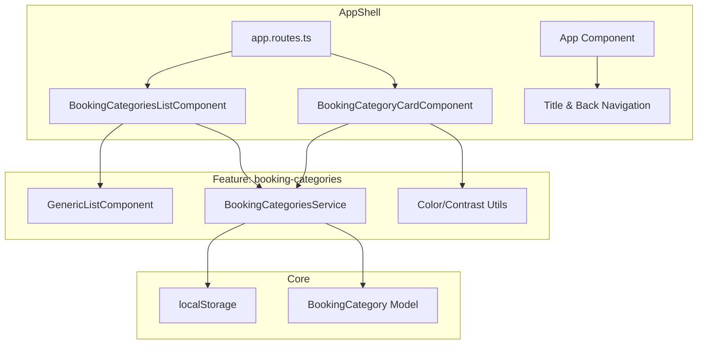

# Design Document: Booking Categories CRUD

## Overview

The Booking Categories CRUD feature provides full lifecycle management of category labels/tags used to classify schedule entries (bookings) in the Service Planner application. It includes:

1. **BookingCategoriesService** — a localStorage-backed service managing category data (create, read, update, delete)
2. **BookingCategoriesListComponent** — a list view at `/booking-categories` using the existing `GenericListComponent` with inline editing, search, and bulk delete
3. **BookingCategoryCardComponent** — a full-page card/form view at `/booking-categories/:categoryId` for detailed editing including tag color configuration
4. **App shell integration** — route registration, title management, and back navigation

### Design Decisions

- **localStorage persistence with JSON serialization**: Categories are persisted as a JSON array under a versioned key (`service-planner.booking-categories.v1`). This enables offline-first behavior without a backend dependency.
- **Immutable return pattern**: All service methods return shallow copies, preventing consumers from accidentally mutating internal state.
- **System category protection**: System categories (defaults) cannot be deleted and have restricted field editing (color and appliesTo are locked), ensuring a baseline always exists.
- **GenericListComponent reuse**: The list view delegates rendering/interaction to the shared `GenericListComponent`, maintaining consistency with other list views (e.g., ResourceViewsListComponent).
- **Timestamp-based IDs**: Using `cat-{Date.now()}` avoids UUID dependencies while providing sufficient uniqueness for client-side operations.

## Architecture



### File Structure

```
webapp/src/app/
├── core/models/
│   └── booking-category.model.ts          # BookingCategory interface + ApplyScope type
├── features/booking-categories/
│   ├── booking-categories.service.ts      # CRUD service with localStorage
│   ├── booking-categories-list.component.ts
│   ├── booking-categories-list.component.html
│   ├── booking-categories-list.component.scss
│   ├── booking-category-card.component.ts
│   ├── booking-category-card.component.html
│   └── booking-category-card.component.scss
├── shared/components/generic-list/        # (existing)
└── app.routes.ts                          # Route registration
```

## Components and Interfaces

### BookingCategory Model

```typescript
// webapp/src/app/core/models/booking-category.model.ts

export type BookingCategoryApplyScope = 'entry' | 'booking-set' | 'order';

export interface BookingCategory {
  id: string;
  label: string;
  color: string;
  appliesTo: BookingCategoryApplyScope;
  tagBackgroundColor?: string;
  tagTextColor?: string;
  description?: string;
  isSystem?: boolean;
}
```

### BookingCategoriesService

```typescript
// webapp/src/app/features/booking-categories/booking-categories.service.ts

@Injectable({ providedIn: 'root' })
export class BookingCategoriesService {
  private readonly STORAGE_KEY = 'service-planner.booking-categories.v1';
  private categories: BookingCategory[] = [];

  constructor() {
    this.categories = this.loadFromStorage();
  }

  getAll(): BookingCategory[]                           // Returns shallow copies
  getById(id: string): BookingCategory | undefined      // Returns shallow copy or undefined
  createNewCategory(): BookingCategory                  // Appends and returns new category
  update(id: string, changes: Partial<BookingCategory>): BookingCategory | undefined
  delete(id: string): void                             // No-op for system categories

  private loadFromStorage(): BookingCategory[]
  private persist(): void
  private getDefaultCategories(): BookingCategory[]
}
```

### BookingCategoriesListComponent

```typescript
// Uses GenericListComponent with columns:
// - label (text, inline-editable)
// - color (color cell type)
// - appliesTo (select dropdown: entry/booking-set/order)
// - description (text, inline-editable)

// Toolbar actions: Add, Edit (inline), Delete, Save
// Row actions: launch (navigate to card)
// Search: filters by label, description, appliesTo label, color value
```

### BookingCategoryCardComponent

```typescript
// Full-page form with:
// - Label input
// - AppliesTo dropdown (disabled for system categories)
// - Description textarea
// - Color selection: predefined palette OR custom hex inputs
// - Tag preview with live background/text color
// - Contrast ratio warning when < 4.5:1
// - Save, Save & Close, Back/Close buttons
```

## Data Models

### Default System Categories

| Label               | Color   | AppliesTo   | isSystem |
|---------------------|---------|-------------|----------|
| Warranty            | #8A3FFC | order       | true     |
| Waiting for parts   | #F1C21B | order       | true     |
| Customer priority   | #DA1E28 | order       | true     |
| Diagnosis           | #0F62FE | booking-set | true     |
| Internal            | #198038 | entry       | true     |

### Predefined Color Palette

| Name    | Color   | Tag Background | Tag Text |
|---------|---------|----------------|----------|
| Blue    | #0F62FE | #D0E2FF        | #002D9C  |
| Cyan    | #1192E8 | #BAE6FF        | #003A6D  |
| Magenta | #D02670 | #FFD6E8        | #740937  |
| Purple  | #8A3FFC | #E8DAFF        | #491D8B  |
| Red     | #DA1E28 | #FFD7D9        | #750E13  |
| Teal    | #009D9A | #9EF0F0        | #004144  |
| Green   | #198038 | #A7F0BA        | #044317  |
| Yellow  | #F1C21B | #FFF1C2        | #684E00  |
| Orange  | #EB6200 | #FFD8B8        | #6E2C00  |

### Contrast Ratio Calculation

The WCAG 2.1 contrast ratio formula is used:
```
relativeLuminance(color) = 0.2126 * R + 0.7152 * G + 0.0722 * B
  (where R, G, B are linearized sRGB values)

contrastRatio(L1, L2) = (max(L1, L2) + 0.05) / (min(L1, L2) + 0.05)
```

A warning is displayed when the ratio is below 4.5:1 (WCAG AA minimum for normal text).

## Correctness Properties

*A property is a characteristic or behavior that should hold true across all valid executions of a system — essentially, a formal statement about what the system should do. Properties serve as the bridge between human-readable specifications and machine-verifiable correctness guarantees.*

### Property 1: Persistence round-trip

*For any* valid array of BookingCategory objects, persisting them to localStorage and then loading from localStorage SHALL produce an equivalent array.

**Validates: Requirements 3.1, 3.5**

### Property 2: Immutability of returned values

*For any* category state, mutating the object returned by `getAll()` or `getById()` SHALL NOT change the internal state of the service (a subsequent call returns the original values).

**Validates: Requirements 4.1, 4.2, 4.4**

### Property 3: Create appends with unique ID and defaults

*For any* sequence of `createNewCategory()` calls, each returned category SHALL have a unique ID matching the pattern `cat-{number}`, label 'New category', appliesTo 'entry', and SHALL appear as the last element in `getAll()`.

**Validates: Requirements 5.1, 5.2, 5.4**

### Property 4: Update merges and preserves unchanged properties

*For any* existing category and any partial update object, after calling `update(id, changes)`, the category SHALL contain all properties from `changes` merged over the original, and all properties NOT in `changes` SHALL remain unchanged.

**Validates: Requirements 6.1, 6.4**

### Property 5: System categories cannot be deleted

*For any* system category (isSystem === true), calling `delete(id)` SHALL leave the categories collection unchanged (same length, same elements).

**Validates: Requirements 7.2**

### Property 6: User categories can be deleted

*For any* user category (isSystem !== true), calling `delete(id)` SHALL reduce the collection size by one and the category SHALL no longer be retrievable via `getById()`.

**Validates: Requirements 7.1**

### Property 7: Search filter correctness

*For any* search term and set of categories, the filtered results SHALL only contain categories where at least one of label, description, appliesTo, or color contains the search term (case-insensitive).

**Validates: Requirements 8.3**

### Property 8: Contrast ratio warning accuracy

*For any* pair of valid hex color strings, if the computed WCAG contrast ratio between them is below 4.5, the contrast check function SHALL return true (warning needed); otherwise it SHALL return false.

**Validates: Requirements 11.5**

## Error Handling

| Scenario | Handling |
|----------|----------|
| localStorage unavailable (SSR) | Service operates with in-memory defaults, no errors thrown |
| Invalid JSON in localStorage | Service falls back to default categories |
| Empty array in localStorage | Service falls back to default categories |
| Update with non-existent ID | Returns `undefined`, no state change |
| Delete with non-existent ID | No-op, no errors thrown |
| Navigation to card with invalid ID | Redirect to `/booking-categories` |
| Contrast calculation with invalid hex | Treat as black (#000000), show warning |

## Testing Strategy

### Unit Tests (Example-based)

- Default categories: verify exact count, labels, colors, and properties
- localStorage fallback scenarios (invalid JSON, empty array, missing key)
- Card view: system category field locking (color, appliesTo disabled)
- Card view: predefined color selection → tag color derivation
- Card view: navigation (save, save-and-close, back)
- List view: add, delete (system protected), inline edit save
- App shell: route titles and back navigation targets

### Property-Based Tests

- **Library**: `fast-check` (already available in project devDependencies)
- **Minimum iterations**: 100 per property
- **Tag format**: `Feature: booking-categories-crud, Property {N}: {title}`

Properties to implement:
1. Persistence round-trip (serialize → deserialize identity)
2. Immutability of returned values (mutation isolation)
3. Create appends with unique ID and defaults
4. Update merges and preserves unchanged properties
5. System categories cannot be deleted
6. User categories can be deleted
7. Search filter correctness
8. Contrast ratio warning accuracy

### Test File Locations

- `webapp/src/app/features/booking-categories/booking-categories.service.spec.ts` — service logic tests (Properties 1–6)
- `webapp/src/app/features/booking-categories/booking-categories-list.spec.ts` — list component tests (Property 7)
- `webapp/src/app/features/booking-categories/booking-category-card.spec.ts` — card component tests (Property 8)
