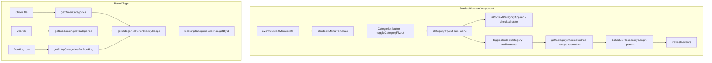

# Design Document: Booking Category Assignment

## Overview

The Booking Category Assignment feature enables planners to assign and remove booking categories to scheduled entries via the event context menu, and displays category tags at the appropriate scope level (order, booking-set, entry) on the side panel's order tiles, job tiles, and booking rows.

This feature integrates into the existing `ServicePlannerComponent` and its template. It depends on:
- **BookingCategoriesService** (from booking-categories-crud) for retrieving the category list and resolving categories by ID
- **ScheduleRepository** for persisting updated entries
- The existing `eventContextMenu` right-click context menu infrastructure

### Design Decisions

- **Inline flyout approach**: The category flyout is rendered as a nested `<div>` within the existing context menu template rather than a separate component, keeping the interaction model simple and consistent with the existing menu items.
- **Scope-based affected entries**: The `getCategoryAffectedEntries` method resolves which entries to modify based on the category's `appliesTo` scope, reusing existing schedule entry associations (order reference, booking set ID).
- **Immediate persistence**: Each toggle immediately persists via `ScheduleRepository.assign()` for each affected entry, matching the existing pattern for entry mutations in the planner.
- **Helper getter pattern**: Category resolution methods (`getOrderCategories`, `getJobBookingSetCategories`, etc.) are regular methods called from the template, consistent with how the component already exposes data to the template.
- **CSS custom property for color**: Each tag uses `--category-color` bound inline, allowing the SCSS to reference it for background/border styling without per-category class generation.

## Architecture



### Data Flow — Category Toggle

1. User right-clicks a scheduler event → `onEventContextMenu` stores the event context
2. User clicks "Categories" → `toggleCategoryFlyout()` sets `isCategoryFlyoutOpen = true`
3. Flyout renders all categories from `bookingCategoriesService.getAll()`, each showing checked/unchecked state via `isContextCategoryApplied(category)`
4. User clicks a category item → `toggleContextCategory(category, domEvent)`
5. `getCategoryAffectedEntries(event, category)` resolves which entries to modify based on `category.appliesTo`
6. Category ID is added to or removed from each affected entry's `categoryIds`
7. Each modified entry is persisted via `scheduleRepository.assign(entry)`
8. Scheduler events are refreshed to reflect the change

### Data Flow — Panel Tag Display

1. Template iterates panel orders → calls `getOrderCategories(order)` for order-scope tags
2. Template iterates jobs within an order → calls `getJobBookingSetCategories(job, order)` for booking-set-scope tags
3. Template iterates bookings within a job → calls `getEntryCategoriesForBooking(booking)` for entry-scope tags
4. Each method delegates to `getCategoriesForEntriesByScope(entries, scope)` which resolves category IDs to `BookingCategory` objects

## Components and Interfaces

### BookingCategory (from booking-categories-crud)

```typescript
interface BookingCategory {
  id: string;
  label: string;
  color: string;
  tagBackgroundColor?: string;
  tagTextColor?: string;
  appliesTo: BookingCategoryApplyScope;
  description?: string;
  isSystem?: boolean;
}

type BookingCategoryApplyScope = 'entry' | 'booking-set' | 'order';
```

### ScheduleEntry (extended with categoryIds)

```typescript
interface ScheduleEntry {
  // ... existing fields ...
  categoryIds?: string[];
}
```

### ServicePlannerComponent — New State & Methods

```typescript
// State
isCategoryFlyoutOpen = false;

// Getter — all categories for the flyout list
get bookingCategories(): BookingCategory[] {
  return this.bookingCategoriesService.getAll();
}

// Toggle flyout visibility
toggleCategoryFlyout(event?: Event): void {
  event?.stopPropagation();
  this.isCategoryFlyoutOpen = !this.isCategoryFlyoutOpen;
}

// Navigate to category management
openCategoryManagement(): void {
  this.eventContextMenu = null;
  this.isCategoryFlyoutOpen = false;
  this.router.navigate(['/booking-categories']);
}

// Determine if category is applied to all affected entries
isContextCategoryApplied(category: BookingCategory): boolean {
  const entries = this.getCategoryAffectedEntries(this.eventContextMenu, category);
  if (!entries.length) return false;
  return entries.every(entry => (entry.categoryIds ?? []).includes(category.id));
}

// Toggle category on/off for affected entries
toggleContextCategory(category: BookingCategory, domEvent?: Event): void {
  domEvent?.stopPropagation();
  const entries = this.getCategoryAffectedEntries(this.eventContextMenu, category);
  const isApplied = this.isContextCategoryApplied(category);

  for (const entry of entries) {
    const ids = entry.categoryIds ?? [];
    if (isApplied) {
      entry.categoryIds = ids.filter(id => id !== category.id);
    } else {
      if (!ids.includes(category.id)) {
        entry.categoryIds = [...ids, category.id];
      }
    }
    this.scheduleRepository.assign(entry).subscribe();
  }
  this.refreshSchedulerEvents();
}

// Resolve affected entries based on category scope
private getCategoryAffectedEntries(
  contextMenu: { eventId: string } | null,
  category: BookingCategory
): ScheduleEntry[] {
  if (!contextMenu) return [];
  const entry = this.allScheduleEntries.find(e => e.id === contextMenu.eventId);
  if (!entry) return [];

  switch (category.appliesTo) {
    case 'entry':
      return [entry];
    case 'booking-set':
      return this.allScheduleEntries.filter(e => e.bookingSetId === entry.bookingSetId);
    case 'order':
      return this.allScheduleEntries.filter(e =>
        e.workOrderReference === entry.workOrderReference
      );
  }
}

// Panel tag helpers
getOrderCategories(order: any): BookingCategory[] {
  const entries = this.allScheduleEntries.filter(e =>
    e.workOrderReference === order.referenceNumber
  );
  return this.getCategoriesForEntriesByScope(entries, 'order');
}

getJobBookingSetCategories(job: any, order: any): BookingCategory[] {
  const entries = this.allScheduleEntries.filter(e =>
    e.jobId === job.id && e.workOrderReference === order.referenceNumber
  );
  return this.getCategoriesForEntriesByScope(entries, 'booking-set');
}

getEntryCategoriesForBooking(booking: JobBooking): BookingCategory[] {
  const entry = this.allScheduleEntries.find(e => e.id === booking.entryId);
  if (!entry) return [];
  return this.getCategoriesForEntriesByScope([entry], 'entry');
}

getEntryCategories(entry: ScheduleEntry): BookingCategory[] {
  return this.getCategoriesForEntriesByScope([entry], 'entry');
}

// Private helper — resolve categoryIds to BookingCategory objects filtered by scope
private getCategoriesForEntriesByScope(
  entries: ScheduleEntry[],
  scope: BookingCategoryApplyScope
): BookingCategory[] {
  const seen = new Set<string>();
  const result: BookingCategory[] = [];

  for (const entry of entries) {
    for (const catId of entry.categoryIds ?? []) {
      if (seen.has(catId)) continue;
      seen.add(catId);
      const category = this.bookingCategoriesService.getById(catId);
      if (category && category.appliesTo === scope) {
        result.push(category);
      }
    }
  }
  return result;
}
```

### Context Menu Close — State Cleanup

The existing `closeContextMenu()` / click-outside handler must reset the flyout:

```typescript
// In the close handler (existing pattern)
closeContextMenu(): void {
  this.isCategoryFlyoutOpen = false;
  this.eventContextMenu = null;
}
```

And when opening a new context menu:

```typescript
onEventContextMenu(payload: EventContextMenuPayload): void {
  this.isCategoryFlyoutOpen = false; // reset before opening
  this.eventContextMenu = { eventId: payload.eventId, x: payload.x, y: payload.y };
}
```

## Data Models

### categoryIds on ScheduleEntry

The `categoryIds` field is an optional `string[]` on `ScheduleEntry`. When absent or empty, the entry has no categories assigned. Each string references a `BookingCategory.id`.

### Category Tag Display Data

No additional data model needed — the template directly calls helper methods that return `BookingCategory[]`, and binds `category.color` and `category.label` to each tag element.

## Correctness Properties

*A property is a characteristic or behavior that should hold true across all valid executions of a system — essentially, a formal statement about what the system should do. Properties serve as the bridge between human-readable specifications and machine-verifiable correctness guarantees.*

### Property 1: Toggle idempotence — double toggle restores original state

*For any* schedule entry and any category, toggling the category on and then off (or off then on) SHALL restore the entry's `categoryIds` to its original state.

**Validates: Requirements 3.2, 3.3**

### Property 2: Scope resolution correctness — affected entries match scope

*For any* context event and any category, `getCategoryAffectedEntries` SHALL return only entries matching the category's `appliesTo` scope: exactly one entry for 'entry' scope, all entries sharing the same `bookingSetId` for 'booking-set' scope, and all entries sharing the same `workOrderReference` for 'order' scope.

**Validates: Requirements 4.1, 4.2, 4.3**

### Property 3: Applied state consistency — isContextCategoryApplied reflects actual data

*For any* category and context event, `isContextCategoryApplied(category)` SHALL return true if and only if every affected entry contains the category's id in its `categoryIds` array.

**Validates: Requirements 2.2, 2.3**

### Property 4: Category scope filtering — getCategoriesForEntriesByScope returns correct scope only

*For any* set of entries and target scope, `getCategoriesForEntriesByScope(entries, scope)` SHALL return only categories whose `appliesTo` matches the target scope, and SHALL deduplicate by category id.

**Validates: Requirements 8.1, 8.2, 8.3**

### Property 5: Toggle adds/removes correctly — category presence after toggle

*For any* category that is NOT fully applied to all affected entries, calling `toggleContextCategory` SHALL result in all affected entries containing that category's id. For any category that IS fully applied, calling `toggleContextCategory` SHALL result in no affected entries containing that category's id.

**Validates: Requirements 3.2, 3.3**

## Error Handling

| Scenario | Handling |
|----------|----------|
| `eventContextMenu` is null when toggle is called | `getCategoryAffectedEntries` returns empty array; no-op |
| Entry not found for context event ID | Returns empty array; no-op |
| `categoryIds` field is undefined on an entry | Treated as empty array `[]` via nullish coalescing |
| `bookingCategoriesService.getById` returns undefined | Skipped silently in `getCategoriesForEntriesByScope` |
| `ScheduleRepository.assign` fails | Entry persists in-memory state but network error is not handled (matches existing pattern) |
| `bookingSetId` is undefined for booking-set scope | Only entries with matching `undefined` bookingSetId are returned (edge case — typically all entries have a bookingSetId) |

## Testing Strategy

### Unit Tests

- Verify `isContextCategoryApplied` returns correct boolean for various entry states
- Verify `toggleContextCategory` adds/removes IDs correctly
- Verify `getCategoryAffectedEntries` returns correct entries for each scope
- Verify `getOrderCategories`, `getJobBookingSetCategories`, `getEntryCategoriesForBooking` return correct filtered categories
- Verify `getCategoriesForEntriesByScope` deduplicates and filters by scope
- Verify flyout state resets on context menu close and new context menu open

### Property-Based Tests (using fast-check)

Each correctness property above should be implemented as a property-based test with minimum 100 iterations:

- **Property 1**: Generate random entries with random categoryIds, toggle a random category, toggle again, assert original state restored
- **Property 2**: Generate entries with various bookingSetId/workOrderReference values, assert scope resolution returns exactly the expected subset
- **Property 3**: Generate entries with known categoryIds, assert `isContextCategoryApplied` matches manual computation
- **Property 4**: Generate entries with mixed-scope categories, assert filtering returns only matching scope with no duplicates
- **Property 5**: Generate entries where category is partially/fully/not applied, toggle, assert final state matches expectation

Configuration:
- Library: `fast-check`
- Minimum iterations: 100
- Tag format: `Feature: booking-category-assignment, Property {N}: {title}`

### Integration Tests

- Verify that toggling a category in the context menu updates the displayed tags on the panel tiles
- Verify that the "Manage categories" button navigates to `/booking-categories`
- Verify keyboard navigation within the category flyout
