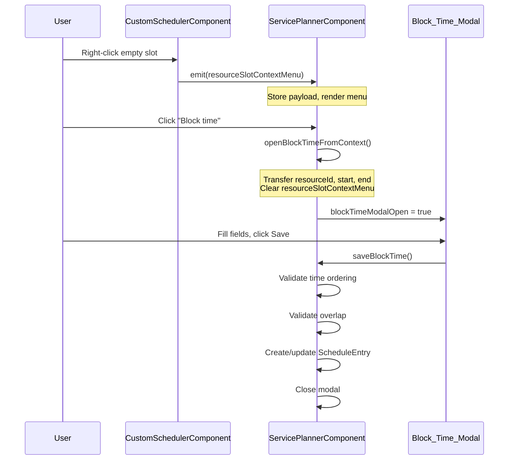

# Design Document: Resource Block Time

## Overview

The Resource Block Time feature enables planners to block time on scheduler resources through a right-click context menu and a modal dialog. It supports creating, editing, and validating resource blocks (e.g., for maintenance, meetings, or unavailability) that appear as distinct visual entries on the scheduler timeline.

The feature spans two Angular standalone components:
1. **CustomSchedulerComponent** — detects right-clicks on empty resource time slots, emits a `resourceSlotContextMenu` event with position and time context, and renders resource-block entries with distinct visual treatment.
2. **ServicePlannerComponent** — receives the event, manages the context menu display, orchestrates the block time modal lifecycle, performs validation (time ordering, overlap), and persists entries via the `ScheduleRepository`.

### Design Decisions

- **Inline state management**: Block time modal state is managed as component-level properties (`blockTimeResourceId`, `blockTimeStartDate`, etc.) rather than a separate form model, consistent with the existing booking modal pattern in the codebase.
- **Event guarding in scheduler**: The `onResourceSlotContextMenu` handler checks if the click target is inside an existing event, capacity lane, or unavailability block before emitting, preventing conflicts with the existing `eventContextMenu` event.
- **Overlap validation scope**: Overlap checks only consider timed events (not other `resource-block` entries) on the same resource, allowing adjacent blocks. The edited entry is excluded from self-overlap detection.
- **Color derivation**: When categories are selected, the block's color is derived from the first selected category's color. When no categories are selected, a default gray (`#6F6F6F`) is used.
- **Carbon context menu pattern**: Rather than using the full `ibm-context-menu` component, the implementation uses a custom `role="menu"` container positioned at the mouse coordinates, consistent with the existing event context menu implementation in the codebase.

## Architecture

```mermaid
graph TD
    subgraph CustomSchedulerComponent
        A[Right-click on empty slot] --> B{Target is event/capacity/unavail?}
        B -->|Yes| C[Do nothing - let eventContextMenu handle]
        B -->|No| D[Compute payload]
        D --> E[Check for active selection]
        E -->|Selection exists & pointer within| F[source='selection', use selection range]
        E -->|No selection| G[source='slot', snap to slot boundaries]
        F --> H[Emit resourceSlotContextMenu event]
        G --> H
    end

    subgraph ServicePlannerComponent
        H -->|@Output binding| I[Store payload in resourceSlotContextMenu]
        I --> J[Render context menu at x,y]
        J --> K{User action}
        K -->|Click "Block time"| L[openBlockTimeFromContext]
        K -->|Click outside / Escape| M[Close menu]
        L --> N[Open Block_Time_Modal]
        N --> O{Save clicked}
        O --> P[Validate time ordering]
        P -->|Invalid| Q[Show validation error]
        P -->|Valid| R[Validate overlap]
        R -->|Overlaps| Q
        R -->|No overlap| S[Persist via ScheduleRepository]
        S --> T[Update events array]
        T --> U[Close modal]
    end

    subgraph Rendering
        V[Resource_Block entry in events] --> W[CustomSchedulerComponent renders tile]
        W --> X[Distinct visual treatment]
        X --> Y{User interaction}
        Y -->|Click| Z[Open edit modal]
        Y -->|Right-click| AA[Emit eventContextMenu]
    end
```

### Data Flow

1. User right-clicks empty slot → `CustomSchedulerComponent.onResourceSlotContextMenu()` computes payload and emits.
2. `ServicePlannerComponent` receives event via `(resourceSlotContextMenu)` output binding, stores payload.
3. Template conditionally renders context menu using `@if (resourceSlotContextMenu)`.
4. User selects "Block time" → `openBlockTimeFromContext()` transfers context data to modal state, clears context menu.
5. User fills modal, clicks save → `saveBlockTime()` validates and persists.
6. New/updated entry added to `events[]` → scheduler re-renders with resource-block tile.

## Components and Interfaces

### SchedulerResourceSlotContextMenuPayload

```typescript
// Defined in scheduler.interface.ts
export interface SchedulerResourceSlotContextMenuPayload extends SchedulerTimeRangePayload {
  resourceId: string;   // Required: the resource where the right-click occurred
  x: number;            // Required: mouse clientX for menu positioning
  y: number;            // Required: mouse clientY for menu positioning
  source?: 'slot' | 'selection';  // Optional: distinguishes single-slot vs selection context
}
```

### SchedulerTimeRangePayload

```typescript
export interface SchedulerTimeRangePayload {
  start: Date;
  end: Date;
  resourceId?: string;  // Optional: when tied to a specific resource
}
```

### ScheduleEntry (Extended)

```typescript
export interface ScheduleEntry {
  id: string;
  jobId: string;
  resourceId: string;
  start: Date;
  end: Date;
  title?: string;
  description?: string;  // Used by resource-block entries for additional context
  color?: string;
  kind?: 'tentative' | 'blocked-order' | 'scheduled' | 'day-capacity' | 'resource-block';
  categoryIds?: string[];
  // ... existing fields
}
```

### CustomSchedulerComponent (Event Emission)

```typescript
// Output
@Output() resourceSlotContextMenu = new EventEmitter<SchedulerResourceSlotContextMenuPayload>();

// Handler
onResourceSlotContextMenu(event: MouseEvent, resourceId: string): void {
  // Guard: skip if target is inside event/capacity/unavail
  // preventDefault to suppress browser context menu
  // Determine source (slot vs selection)
  // Compute start/end from slot or active selection
  // Emit payload
}

// Rendering helper
isResourceBlockEvent(event: SchedulerEvent): boolean {
  return event.meta?.entry?.kind === 'resource-block';
}
```

### ServicePlannerComponent (Modal Lifecycle)

```typescript
// State
resourceSlotContextMenu: SchedulerResourceSlotContextMenuPayload | null = null;
blockTimeModalOpen = false;
blockTimeResourceId = '';
blockTimeStartDate = '';
blockTimeStartTime = '';
blockTimeEndDate = '';
blockTimeEndTime = '';
blockTimeTitle = '';
blockTimeDescription = '';
blockTimeEditingEntryId: string | null = null;
blockTimeCategoryIds: string[] = [];

// Context menu handlers
onResourceSlotContextMenu(payload: SchedulerResourceSlotContextMenuPayload): void;
closeResourceSlotContextMenu(): void;
getResourceSlotContextMenuTitle(): string;
getResourceSlotContextMenuDetail(): string;

// Modal lifecycle
openBlockTimeFromContext(): void;
openBlockTimeModal(resourceId: string, start: Date, end: Date, entry?: ScheduleEntry): void;
closeBlockTimeModal(): void;

// Category management
toggleBlockTimeCategory(categoryId: string): void;
isBlockTimeCategorySelected(categoryId: string): boolean;

// Save & validation
saveBlockTime(): void;
isResourceBlockPlacementValid(resourceId: string, start: Date, end: Date): boolean;
```

### Template Binding

```html
<!-- Scheduler component -->
<app-custom-scheduler
  (resourceSlotContextMenu)="onResourceSlotContextMenu($event)"
  ...
></app-custom-scheduler>

<!-- Context menu (conditionally rendered) -->
@if (resourceSlotContextMenu) {
  <div role="menu" [style.left.px]="resourceSlotContextMenu.x" [style.top.px]="resourceSlotContextMenu.y">
    <div>{{ getResourceSlotContextMenuDetail() }}</div>
    <button role="menuitem" (click)="openBlockTimeFromContext()">
      {{ getResourceSlotContextMenuTitle() }}
    </button>
  </div>
}

<!-- Block time modal (conditionally rendered) -->
@if (blockTimeModalOpen) {
  <div class="booking-modal-overlay">
    <section role="dialog" aria-modal="true" aria-labelledby="block-time-modal-title">
      <!-- Resource (read-only), date/time pickers, title, description, categories -->
    </section>
  </div>
}
```

## Data Models

### Resource Block Entry Structure

| Field | Type | Source | Notes |
|-------|------|--------|-------|
| id | string | Generated (`block-{timestamp}`) or existing | Unique identifier |
| jobId | string | Always `'resource-block'` | Sentinel value distinguishing from real job entries |
| resourceId | string | From context menu payload or edit entry | Target resource |
| start | Date | From modal date/time inputs | Block start |
| end | Date | From modal date/time inputs | Block end |
| title | string | From modal title input | User-provided label |
| description | string | From modal description textarea | Optional details |
| kind | `'resource-block'` | Always set | Distinguishes block entries from job entries |
| color | string | First category color or `'#6F6F6F'` | Visual color on timeline |
| categoryIds | string[] | undefined | From blockTimeCategoryIds | Selected categories |
| workorderItemStatus | `'scheduled'` | Always set | Enables consistent tag rendering |

### Context Menu to Modal Data Transfer



### Overlap Validation Logic

```typescript
isResourceBlockPlacementValid(resourceId: string, start: Date, end: Date): boolean {
  // 1. Check within working hours (09:00 - 21:00)
  // 2. Check no overlap with existing timed events on same resource
  //    (excluding self when editing: event.id !== blockTimeEditingEntryId)
  // 3. Check no overlap with capacity blocks on same resource/day
  // 4. Check no overlap with unavailability blocks on same resource
  // Returns false if any overlap detected
}
```

## Correctness Properties

*A property is a characteristic or behavior that should hold true across all valid executions of a system — essentially, a formal statement about what the system should do. Properties serve as the bridge between human-readable specifications and machine-verifiable correctness guarantees.*

### Property 1: Context menu payload completeness

*For any* empty resource time slot right-click with a given resourceId and pointer coordinates, the emitted `SchedulerResourceSlotContextMenuPayload` SHALL contain: the correct resourceId, valid start and end dates (start < end), the pointer's x and y coordinates, and source set to `'slot'` when no selection is active or `'selection'` when triggered within an active time range selection.

**Validates: Requirements 1.1, 1.3, 1.4**

### Property 2: Context menu detail formatting

*For any* `SchedulerResourceSlotContextMenuPayload` with a valid resourceId and time range, the `getResourceSlotContextMenuDetail()` method SHALL return a string containing the resource's display label and a formatted representation of the time range.

**Validates: Requirements 2.6**

### Property 3: Modal opening transfers context and clears menu

*For any* non-null `resourceSlotContextMenu` payload, invoking `openBlockTimeFromContext()` SHALL set `blockTimeResourceId` to the payload's resourceId, set the start/end fields to match the payload's start and end times, set `blockTimeModalOpen` to true, and set `resourceSlotContextMenu` to null.

**Validates: Requirements 3.1, 3.2, 2.1**

### Property 4: Edit mode populates all fields from existing entry

*For any* existing `ScheduleEntry` with `kind='resource-block'`, opening the Block_Time_Modal in edit mode SHALL populate: `blockTimeResourceId` with the entry's resourceId, start/end fields matching the entry's start/end, `blockTimeTitle` with the entry's title, `blockTimeDescription` with the entry's description, and `blockTimeCategoryIds` with the entry's categoryIds.

**Validates: Requirements 3.4, 5.5, 10.3**

### Property 5: Category toggle is a self-inverse operation

*For any* categoryId and initial `blockTimeCategoryIds` state, invoking `toggleBlockTimeCategory(categoryId)` twice SHALL return `blockTimeCategoryIds` to its original state. Additionally, after a single toggle, `isBlockTimeCategorySelected(categoryId)` SHALL return the opposite of its value before the toggle.

**Validates: Requirements 5.2, 5.3**

### Property 6: Saved entry contains all required fields with correct values

*For any* valid block time modal state (non-empty title, valid resourceId, start < end, no overlaps), the created `ScheduleEntry` SHALL have: `kind` equal to `'resource-block'`, `jobId` equal to `'resource-block'`, the specified resourceId, start, end, trimmed title, trimmed description, the selected categoryIds, and color derived from the first selected category (or default `'#6F6F6F'` when no categories are selected).

**Validates: Requirements 6.1, 6.2, 6.3**

### Property 7: Time ordering validation rejects invalid ranges

*For any* start and end date pair where start >= end, invoking `saveBlockTime()` SHALL not create or update any ScheduleEntry and SHALL not close the modal.

**Validates: Requirements 6.6**

### Property 8: Overlap detection prevents conflicts while allowing self-overlap in edit mode

*For any* set of existing timed events on a resource and a proposed block time range: (a) if the block overlaps any existing event, save SHALL be prevented; (b) if the block does not overlap any existing event, save SHALL proceed; (c) when editing an existing Resource_Block, the entry being edited SHALL be excluded from overlap detection.

**Validates: Requirements 7.1, 7.2, 7.3**

## Error Handling

| Scenario | Handling |
|----------|----------|
| Right-click on existing event/capacity/unavailability | `onResourceSlotContextMenu` returns early without emitting (guard clause) |
| Pointer position cannot be resolved to a date | `getDateFromTimelinePointer` returns null, handler returns early |
| Start time >= end time on save | Save prevented, validation error displayed via `setSchedulingError()` |
| Block overlaps existing event on same resource | Save prevented, scheduling error displayed: "Choose a free time inside working hours for this resource" |
| Block falls outside working hours (09:00–21:00) | Save prevented by `isResourceBlockPlacementValid()` |
| Empty title on save | Save prevented (trim check: `!this.blockTimeTitle.trim()`) |
| No resourceId set | Save prevented (falsy check on `this.blockTimeResourceId`) |
| ScheduleRepository error on create/update | Observable error propagation (not explicitly caught — consistent with existing booking save pattern) |
| User clicks outside context menu | `@HostListener('document:click')` sets `resourceSlotContextMenu` to null |
| User presses Escape with menu open | `@HostListener('document:keydown.escape')` sets `resourceSlotContextMenu` to null |
| Modal opened with no categories available | Category section shows "No categories defined." message |

## Testing Strategy

### Unit Tests (Example-Based)

- Verify `onResourceSlotContextMenu` does not emit when target is inside `.scheduler__event`
- Verify `preventDefault()` is called on the mouse event when emitting context menu
- Verify context menu renders at correct (x, y) coordinates from payload
- Verify context menu displays "Block time" / "Block selected time" / "Block this slot" labels correctly
- Verify clicking outside context menu closes it (sets `resourceSlotContextMenu` to null)
- Verify Escape key closes context menu
- Verify modal opens in create mode with empty title and description
- Verify modal renders all required form fields (resource, start date/time, end date/time, title, description, categories)
- Verify modal focus traps and ARIA attributes are correct
- Verify resource-block events render with distinct visual treatment (CSS class `scheduler__event--resource-block`)
- Verify right-click on resource-block tile emits `eventContextMenu` not `resourceSlotContextMenu`
- Verify `blockTimeModalOpen` becomes false after successful save
- Verify default color `#6F6F6F` is used when no categories are selected

### Property-Based Tests

Property-based testing is well-suited for this feature because:
- The validation logic (time ordering, overlap detection) operates over arbitrary date ranges and event sets
- The category toggle is a pure operation with clear algebraic properties (self-inverse)
- The data transfer from context to modal state is a pure mapping over arbitrary payloads
- The overlap detection involves set-like geometric reasoning over time intervals

**Library**: [fast-check](https://github.com/dubzzz/fast-check)

**Configuration**:
- Minimum 100 iterations per property test
- Each test tagged with: `Feature: resource-block-time, Property {N}: {description}`

**Properties to implement**:
1. Context menu payload completeness (Property 1)
2. Context menu detail formatting (Property 2)
3. Modal opening transfers context and clears menu (Property 3)
4. Edit mode populates all fields from existing entry (Property 4)
5. Category toggle self-inverse (Property 5)
6. Saved entry contains all required fields (Property 6)
7. Time ordering validation rejects invalid ranges (Property 7)
8. Overlap detection correctness (Property 8)

### Integration Tests

- End-to-end flow: right-click → context menu → "Block time" → modal → save → tile appears on scheduler
- End-to-end flow: click existing resource-block tile → modal opens in edit mode → save updates tile
- Verify overlap validation shows error when block conflicts with existing event
- Verify context menu appears at correct position relative to viewport
- Verify keyboard navigation through context menu items (Arrow keys, Enter, Escape)
