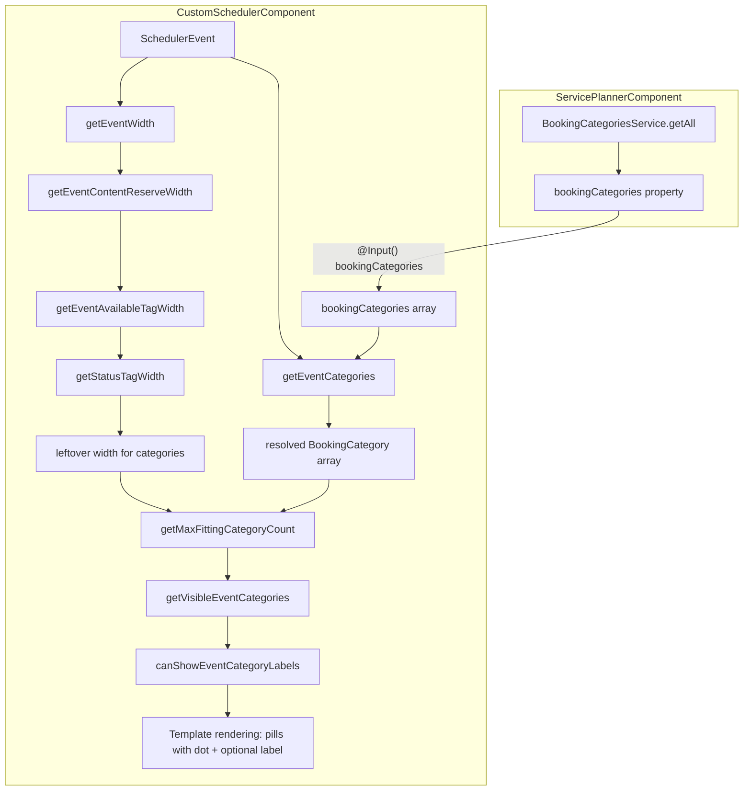

# Design Document: Scheduler Category Tags

## Overview

The Scheduler Category Tags feature adds visual category tags (color-coded pills) to event tiles in the custom scheduler component. Each event can have multiple categories assigned via `categoryIds` on its `ScheduleEntry`. The scheduler resolves these IDs against a provided `BookingCategory[]` input and renders colored pills in the event tile's tag area, alongside the existing status tag.

The core challenge is **adaptive width management**: events vary in width depending on duration and zoom level, so the tag system must gracefully degrade from full labels → icon-only → hidden, always prioritizing the status tag and fitting as many category tags as space allows.

### Design Decisions

- **Greedy fitting algorithm**: Categories are fitted left-to-right in order. The algorithm accumulates widths and stops when the next tag would overflow. This is O(n) in the number of categories and terminates early when space is exhausted.
- **Text width estimation over DOM measurement**: Using a constant `~7.25px/char` avoids layout thrashing. This is an approximation but sufficient for the greedy fit decision.
- **Mode selection heuristic**: When choosing between full-label mode (fewer tags visible) and icon-only mode (more tags visible), the system picks whichever shows more categories. If equal, full-label mode wins for readability.
- **Input-driven architecture**: The parent `ServicePlannerComponent` passes the full `BookingCategory[]` array as an input. The scheduler does not inject `BookingCategoriesService` directly, keeping it decoupled and testable.

## Architecture



### Data Flow

1. `ServicePlannerComponent` retrieves all categories from `BookingCategoriesService.getAll()` and binds them to `[bookingCategories]`.
2. For each event tile, the template calls `getVisibleEventCategories(event)` which:
   - Resolves `event.meta.entry.categoryIds` → `BookingCategory[]` via `getEventCategories(event)`
   - Calculates available tag width via the adaptive width pipeline
   - Determines how many fit and in what mode (full label vs icon-only)
3. The template renders the returned categories as pill elements with appropriate styling.

## Components and Interfaces

### Constants

```typescript
// Added to custom-scheduler.component.ts
const EVENT_FULL_TAG_MIN_WIDTH = 360;    // Min event width for full label tags
const EVENT_ICON_TAG_MIN_WIDTH = 150;    // Min event width for icon-only tags
const EVENT_CONTENT_MAX_WIDTH = 120;     // Max text content width for reserve calc
const EVENT_CONTENT_PADDING = 40;        // Padding added to content width
const EVENT_CONTENT_MAX_RESERVE = 160;   // Max content reserve (MAX_WIDTH + PADDING)
```

### New Input on CustomSchedulerComponent

```typescript
@Input() bookingCategories: BookingCategory[] = [];
```

### New Methods on CustomSchedulerComponent

```typescript
/**
 * Estimates text width using a fixed per-character approximation.
 * Avoids DOM measurement for performance.
 */
estimateTextWidth(text: string, pxPerChar = 7.25): number {
  return text.length * pxPerChar;
}

/**
 * Resolves an event's categoryIds to BookingCategory objects.
 * Filters out unmatched IDs and preserves order.
 */
getEventCategories(event: SchedulerEvent): BookingCategory[] {
  const categoryIds = event.meta?.entry?.categoryIds;
  if (!categoryIds || categoryIds.length === 0) return [];
  return categoryIds
    .map(id => this.bookingCategories.find(cat => cat.id === id))
    .filter((cat): cat is BookingCategory => !!cat);
}

/**
 * Calculates the content reserve width for an event.
 * This is the space reserved for the event's text content before tags.
 */
getEventContentReserveWidth(event: SchedulerEvent): number {
  const eventWidth = this.getEventWidth(event);
  const jobDesc = this.getEventJobDescription(event);
  const detail = this.getEventDetail(event);
  const customerVehicle = this.getEventCustomerVehicleDetail(event);

  const maxTextWidth = Math.max(
    this.estimateTextWidth(jobDesc),
    this.estimateTextWidth(detail),
    this.estimateTextWidth(customerVehicle)
  );

  const contentNeeded = maxTextWidth + EVENT_CONTENT_PADDING;
  let reserve = Math.min(contentNeeded, EVENT_CONTENT_MAX_RESERVE, eventWidth);
  reserve = Math.max(reserve, 120);
  reserve = Math.min(reserve, eventWidth - 60);
  return Math.max(reserve, 0);
}

/**
 * Returns the available tag width after content reservation.
 */
getEventAvailableTagWidth(event: SchedulerEvent): number {
  const eventWidth = this.getEventWidth(event);
  const reserve = this.getEventContentReserveWidth(event);
  return Math.max(eventWidth - reserve, 0);
}

/**
 * Calculates the status tag width for an event.
 */
getStatusTagWidth(event: SchedulerEvent, withLabel: boolean): number {
  const iconSize = 16;
  const padding = 16;
  const gap = withLabel ? 4 : 0;
  const labelWidth = withLabel ? this.estimateTextWidth(this.getEventTagLabel(event)) : 0;
  return Math.max(iconSize + padding + gap + labelWidth, 32);
}

/**
 * Calculates a single category tag's width.
 */
getCategoryTagWidth(category: BookingCategory, withLabel: boolean): number {
  const iconSize = 16;
  const padding = 16; // 8px each side
  const gap = withLabel ? 4 : 0;
  const labelWidth = withLabel ? this.estimateTextWidth(category.label) : 0;
  return Math.max(iconSize + padding + gap + labelWidth, 24);
}

/**
 * Greedy fit: returns how many categories fit within availableWidth.
 */
getMaxFittingCategoryCount(
  categories: BookingCategory[],
  availableWidth: number,
  withLabel: boolean
): number {
  let used = 0;
  let count = 0;
  for (const cat of categories) {
    const spacing = count === 0 ? 0 : 2;
    const tagWidth = this.getCategoryTagWidth(cat, withLabel);
    if (used + spacing + tagWidth > availableWidth) break;
    used += spacing + tagWidth;
    count++;
  }
  return count;
}

/**
 * Determines the visible categories for an event, selecting the optimal display mode.
 */
getVisibleEventCategories(event: SchedulerEvent): BookingCategory[] {
  const categories = this.getEventCategories(event);
  if (categories.length === 0) return [];

  const eventWidth = this.getEventWidth(event);
  if (eventWidth < EVENT_ICON_TAG_MIN_WIDTH) return [];

  const availableTagWidth = this.getEventAvailableTagWidth(event);
  const showLabels = eventWidth >= EVENT_FULL_TAG_MIN_WIDTH;

  // Allocate status tag width first
  const statusWithLabel = this.getStatusTagWidth(event, showLabels);
  const statusIconOnly = this.getStatusTagWidth(event, false);

  let leftover: number;
  if (availableTagWidth >= statusWithLabel && showLabels) {
    leftover = availableTagWidth - statusWithLabel;
  } else if (availableTagWidth >= statusIconOnly) {
    leftover = availableTagWidth - statusIconOnly;
  } else {
    return []; // No space even for status tag icon
  }

  if (leftover <= 0) return [];

  // Count fits in both modes
  const fullCount = showLabels
    ? this.getMaxFittingCategoryCount(categories, leftover, true)
    : 0;
  const iconCount = this.getMaxFittingCategoryCount(categories, leftover, false);

  // Prefer mode that shows more categories; ties go to full-label
  const finalCount = iconCount > fullCount ? iconCount : fullCount;
  return categories.slice(0, finalCount);
}

/**
 * Returns whether category labels can be shown (full label mode).
 */
canShowEventCategoryLabels(event: SchedulerEvent): boolean {
  if (this.shouldShowEventTagIconOnly(event)) return false;

  const eventWidth = this.getEventWidth(event);
  if (eventWidth < EVENT_FULL_TAG_MIN_WIDTH) return false;

  const categories = this.getEventCategories(event);
  if (categories.length === 0) return false;

  const availableTagWidth = this.getEventAvailableTagWidth(event);
  const statusWidth = this.getStatusTagWidth(event, true);
  const leftover = availableTagWidth - statusWidth;

  const fullCount = this.getMaxFittingCategoryCount(categories, leftover, true);
  const iconCount = this.getMaxFittingCategoryCount(categories, leftover, false);

  // Show labels only if full-label mode shows >= icon-only mode count
  return fullCount >= iconCount && fullCount > 0;
}
```

### Template Changes (Conceptual)

```html
<!-- Inside event tile tag area, after status tag -->
<ng-container *ngIf="getVisibleEventCategories(event) as visibleCategories">
  <span
    *ngFor="let category of visibleCategories"
    class="scheduler-event__category-tag"
    [style.background-color]="category.tagBackgroundColor || category.color + '20'"
    [title]="category.label"
    [attr.aria-label]="category.label"
  >
    <span
      class="scheduler-event__category-dot"
      [style.background-color]="category.color"
      aria-hidden="true"
    ></span>
    <span
      *ngIf="canShowEventCategoryLabels(event)"
      class="scheduler-event__category-label"
      [style.color]="category.tagTextColor || category.color"
    >
      {{ category.label }}
    </span>
  </span>
</ng-container>
```

### ServicePlannerComponent Binding

```typescript
// In service-planner.component.ts — property to pass to scheduler
get schedulerBookingCategories(): BookingCategory[] {
  return this.bookingCategoriesService.getAll();
}
```

```html
<!-- In service-planner.component.html -->
<app-custom-scheduler
  [bookingCategories]="schedulerBookingCategories"
  ...
></app-custom-scheduler>
```

### SCSS Styles

```scss
.scheduler-event__category-tag {
  display: inline-flex;
  align-items: center;
  gap: 4px;
  padding: 0 8px;
  border-radius: 12px;
  height: 20px;
  font-size: 11px;
  white-space: nowrap;
  margin-left: 2px;

  &:first-child {
    margin-left: 0;
  }
}

.scheduler-event__category-dot {
  width: 8px;
  height: 8px;
  border-radius: 50%;
  flex-shrink: 0;
}

.scheduler-event__category-label {
  overflow: hidden;
  text-overflow: ellipsis;
  max-width: 80px;
}
```

## Data Models

### BookingCategory (from booking-categories-crud spec)

```typescript
interface BookingCategory {
  id: string;
  label: string;
  color: string;
  appliesTo: 'entry' | 'booking-set' | 'order';
  tagBackgroundColor?: string;
  tagTextColor?: string;
  description?: string;
  isSystem?: boolean;
}
```

### ScheduleEntry (extended)

```typescript
interface ScheduleEntry {
  // ... existing fields ...
  categoryIds?: string[];  // Added by booking-categories-crud spec
}
```

### Width Calculation Pipeline

| Step | Input | Output | Formula |
|------|-------|--------|---------|
| Event width | event start/end, timeline scale | pixels | `endPx - startPx` (from existing `getEventWidth`) |
| Content reserve | event text lines, event width | pixels | `min(max(maxTextWidth + 40, 120), min(160, eventWidth), eventWidth - 60)` |
| Available tag width | event width, content reserve | pixels | `max(eventWidth - contentReserve, 0)` |
| Status tag width | label text, withLabel flag | pixels | `max(16 + 16 + (withLabel ? 4 + labelWidth : 0), 32)` |
| Category tag width | category label, withLabel flag | pixels | `max(16 + 16 + (withLabel ? 4 + labelWidth : 0), 24)` |
| Leftover for categories | available tag width, status tag width | pixels | `availableTagWidth - statusTagWidth` |
| Fitting count | categories, leftover, withLabel | integer | Greedy accumulation with 2px spacing |

## Correctness Properties

*A property is a characteristic or behavior that should hold true across all valid executions of a system — essentially, a formal statement about what the system should do. Properties serve as the bridge between human-readable specifications and machine-verifiable correctness guarantees.*

### Property 1: Category resolution correctness and order preservation

*For any* event with `categoryIds` array and any `bookingCategories` input array, `getEventCategories(event)` SHALL return exactly those BookingCategory objects whose IDs appear in `categoryIds` (in the same order), excluding any IDs not found in `bookingCategories`.

**Validates: Requirements 2.1, 2.2, 2.3, 2.4, 2.5**

### Property 2: Content reserve width bounds

*For any* event with non-negative width ≥ 60, `getEventContentReserveWidth(event)` SHALL return a value that is: (a) at most `min(EVENT_CONTENT_MAX_RESERVE, eventWidth)`, (b) at least 120 when eventWidth ≥ 180, and (c) at most `eventWidth - 60`.

**Validates: Requirements 4.5, 4.6, 4.7**

### Property 3: Available tag width is non-negative and correctly derived

*For any* event, `getEventAvailableTagWidth(event)` SHALL equal `max(getEventWidth(event) - getEventContentReserveWidth(event), 0)` and SHALL always be non-negative.

**Validates: Requirements 5.1, 5.2**

### Property 4: Category tag width formula and minimum

*For any* BookingCategory and boolean `withLabel`, `getCategoryTagWidth(category, withLabel)` SHALL be at least 24px. When `withLabel` is true, the width SHALL include `4 + estimateTextWidth(category.label)` beyond the base 32px. When `withLabel` is false, the width SHALL be exactly `max(32, 24)` = 32px.

**Validates: Requirements 7.1, 7.2, 7.3, 7.4**

### Property 5: Greedy fit count is maximal

*For any* array of categories, available width, and withLabel flag, `getMaxFittingCategoryCount` SHALL return the largest `n` such that the sum of the first `n` tag widths plus `2*(n-1)` spacing pixels does not exceed `availableWidth`. Adding one more category SHALL exceed available width (or all categories already fit).

**Validates: Requirements 8.1, 8.2, 8.3, 8.4**

### Property 6: Visible categories mode selection maximizes count

*For any* event with categories where both full-label and icon-only modes are evaluated, `getVisibleEventCategories` SHALL return at least as many categories as the minimum of `fullCount` and `iconCount`, preferring whichever mode shows more.

**Validates: Requirements 9.3, 9.4, 9.5, 9.6**

### Property 7: Display mode thresholds are respected

*For any* event, when `getEventWidth(event) < EVENT_ICON_TAG_MIN_WIDTH` (150px), `getVisibleEventCategories` SHALL return an empty array. When `EVENT_ICON_TAG_MIN_WIDTH ≤ width < EVENT_FULL_TAG_MIN_WIDTH`, `canShowEventCategoryLabels` SHALL return false.

**Validates: Requirements 10.1, 10.2, 10.3, 10.4**

### Property 8: Visible categories are always a prefix of resolved categories

*For any* event, the result of `getVisibleEventCategories(event)` SHALL be a prefix (first N elements) of `getEventCategories(event)` for some N ≥ 0.

**Validates: Requirements 9.6, 12.2**

## Error Handling

| Scenario | Handling |
|----------|----------|
| `event.meta` is undefined | `getEventCategories` returns `[]` — no categories rendered |
| `event.meta.entry` is undefined | `getEventCategories` returns `[]` — no categories rendered |
| `event.meta.entry.categoryIds` is undefined or empty | `getEventCategories` returns `[]` — no categories rendered |
| `bookingCategories` is empty | Resolution finds no matches → no category tags rendered |
| Category has no `tagBackgroundColor` | Template derives background from `category.color` with alpha |
| Category has no `tagTextColor` | Template uses `category.color` as text color |
| Event width is 0 or negative | `getEventAvailableTagWidth` returns 0 → no tags rendered |
| All categories filtered out (no space) | Only status tag rendered; category tag area is empty |
| Duplicate categoryIds | Each resolved independently; may show same category twice |

## Testing Strategy

### Unit Tests (Example-Based)

- Verify `@Input() bookingCategories` defaults to empty array
- Verify template renders category pills with correct CSS classes
- Verify aria-label and title attributes on icon-only tags
- Verify aria-hidden on dot elements
- Verify tag rendering order (status first, then categories)
- Verify 2px spacing between tags
- Verify no category tags when event width < 150px
- Verify ServicePlannerComponent passes categories to scheduler input

### Property-Based Tests

Property-based testing is well-suited for this feature because:
- The width calculation pipeline involves pure arithmetic functions
- The greedy fit algorithm has universal invariants (maximality, non-overflow)
- Category resolution is a pure mapping with clear input/output relationships
- The mode selection logic has universal properties about optimality

**Library**: [fast-check](https://github.com/dubzzz/fast-check) (standard for TypeScript PBT)

**Configuration**:
- Minimum 100 iterations per property test
- Each test tagged with: `Feature: scheduler-category-tags, Property {N}: {description}`

**Properties to implement**:
1. Category resolution correctness and order preservation (Property 1)
2. Content reserve width bounds (Property 2)
3. Available tag width non-negative and correctly derived (Property 3)
4. Category tag width formula and minimum (Property 4)
5. Greedy fit count is maximal (Property 5)
6. Visible categories mode selection maximizes count (Property 6)
7. Display mode thresholds respected (Property 7)
8. Visible categories are always a prefix (Property 8)

### Integration Tests

- End-to-end: ServicePlannerComponent binds categories to scheduler and categories display on events
- Verify re-evaluation when bookingCategories input changes
- Verify interaction with existing status tag rendering
